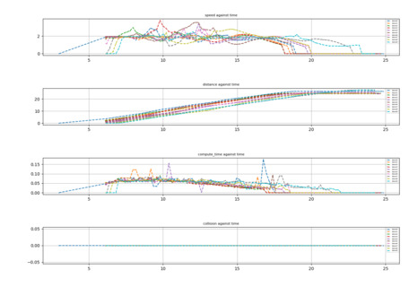

# Fast Obstacle Avoidance on Locally Mapped Environment (FOALME)

## Introduction

`foalme` serves a complete trajectory and optimization server with avoidance on ROS using the `bs-traj-server` which acts as a wrapper to pass data into the module. In addition, `simple_quad_simulator` consist of a quadcopter simulator, which can spawn several agents to test the performance of this trajectory planner package.

| video demonstration of 20 agents | results of 10 drones in antipodal |
|:--:|:--:|
|  |  |

```bash
# Some Benefits and Uniqueness of the Package
    - Custom variant of RRT, Transformed Bounding Box RRT (TBB-RRT)
    - General Matrix Representation of Bspline library
    - Bspline trajectory server for real-time path representation
    - LBFGS-B optimization server
```

---

### Dependencies
 
- bspline_trajectory_ros (https://github.com/matthewoots/bspline_trajectory_ros.git)
    - bs-traj-server (https://github.com/matthewoots/bs-traj-server.git)
    - LBFGSpp (https://github.com/matthewoots/LBFGSpp.git)
    - libbspline (https://github.com/matthewoots/libbspline.git)
    - librrtserver (https://github.com/matthewoots/librrtserver.git)
- simple_quad_simulator (https://github.com/matthewoots/simple_quad_simulator.git)
- foalme_user_server

---

### Setup

For starters who do not know how to use ROS and do not have a prior workspace, just run the commands below and all will be fine

Please have an SSH-key for your machine by using `ssh-keygen` and finding your key in `id_rsa.pub`
```bash
mkdir -p catkin_ws/src
cd catkin_ws/src
git clone git@github.com:matthewoots/foalme.git --recurse-submodules
cd ..
catkin build
# Or you can compile only the needed packages
# catkin build bs_trajectory_ros quad foalme_user_server
```

---

### Run scripts in simple_quad_simulator

1. Run the scripts from `simple_quad_simulator` package, `gen_launch_w_trajectory.py` and `gen_rviz_display.py` this will generate 2 files one in `launch` and the other in `rviz`.
2. Copy the `generated_XX_XX.launch` file into `foalme_user_server/launch`
3. copy one of the `X_drone_user_server.launch` files and change `X` to the number of drones you want to launch
4. Change the launch file details to the specifications you want
```xml
<arg name="formation_type" value="antipodal or left-right-facing or top-down-facing"/>
...
<param name="agents" value="X"/>
...
<param name="file_location" value="X" />
```

### Running and launching

```bash
# XX is the number of drones
roslaunch foalme_user_server XX_drone_user_server.launch
```

Logging module has been added, agent logs are in CSV using the `CSVWriter` (https://github.com/al-eax/CSVWriter.git), they are stored in `/home/$USER/Documents`. To display them as shown in above:

```bash
cd foalme_user_server/scripts
# XX is the number of drones
python3 csv_reader.py XX
```